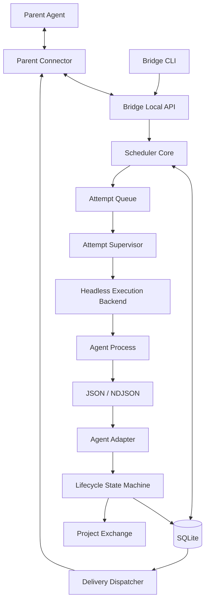
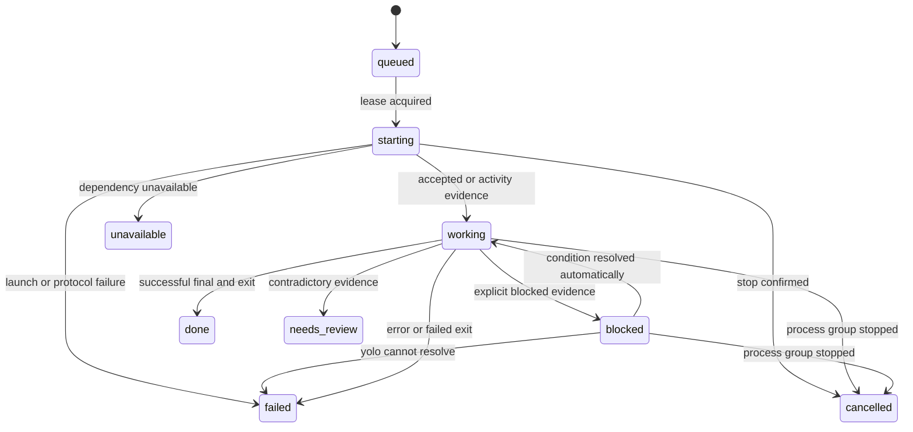

# Subagent Bridge 设计

状态：初始架构设计  
日期：2026-09-21

## 1. 项目定位

Subagent Bridge 是一个以独立 headless Agent 进程为执行核心的多后端调度系统。主 Agent 将任务提交给 Bridge；Bridge 负责选择厂商 adapter 和执行后端、启动独立进程、统一生命周期、维护会话、收集结构化结果，并按照 `idle` 或 `immediate` 策略把结果投递回主 Agent 会话。

项目是独立服务，不集成终端复用器，不创建或管理 pane/tab，不读取终端屏幕，不同步任何外部进程管理器的状态。

首批目标 Agent：

- DeepSeek Harness（DSH）
- Codex CLI
- Claude Code
- Grok CLI
- Kimi Code
- agy

项目只接入正式的非交互式、机器可读接口。终端文本和 TUI 图形不是控制面或权威状态来源。

## 2. 设计目标

1. 支持多个 headless 执行后端，同时保持统一任务、会话和结果协议。
2. 将厂商 JSON/NDJSON 事件归一化为稳定的 `working/blocked/done` 等状态。
3. 每个 attempt 使用独立进程；跨任务连续上下文统一使用 `resume`。
4. Bridge 自己生成并维护 session id，厂商 session ref 只作为内部绑定。
5. 所有子 Agent 强制使用无人值守 yolo 配置。
6. 保留父会话 `idle` 与 `immediate` 两种投递模式。
7. 禁止子 Agent 通过 Bridge 或厂商内置能力继续派生 Agent。
8. 数据库、事件和交接文件足以完成崩溃恢复与审计，不依赖外部状态同步。

## 3. 明确舍弃的能力

- pane/tab/TUI 可视化；
- 终端屏幕检测和键盘输入；
- live `reuse`；
- 交互式权限批准；
- 外部 agent session identity；
- 外部运维状态同步；
- 子 Agent 多级派生；
- 模糊选择最近会话；
- 从私有目录或文件名猜测原生 session id。

运行情况通过 Bridge CLI/API、事件日志和结构化状态查询，不通过终端布局展示。

## 4. 总体架构



核心组件：

1. **Bridge Daemon**：持久控制面，提供本地 socket/API、任务队列、租约、dispatcher 和 reconcile。
2. **Scheduler Core**：校验任务和能力，创建 task、session、attempt 与 delivery。
3. **Attempt Supervisor**：启动并持有子进程组，读取结构化流，处理 deadline、取消和结算。
4. **ExecutionBackend**：负责本地、容器或远程 headless 进程生命周期。
5. **AgentAdapter**：构造厂商 argv，解析事件，提取原生 session ref 和最终结果。
6. **Lifecycle State Machine**：将统一事件折叠为 Bridge 状态。
7. **Parent Connector**：注册父会话、上报状态、接收并确认交接消息。
8. **Delivery Dispatcher**：实现 `idle`/`immediate` 投递、去重与 acknowledgment。
9. **Reconciler**：恢复过期 lease、未结算 attempt 和未完成 delivery。

Bridge Daemon 必须由用户显式启动或由 systemd/supervisor 管理。CLI 初始化命令不得偷偷 fork 常驻服务。

## 5. Headless 执行后端

### 5.1 后端类型

第一阶段：

- `local_process`：本机独立进程组。

后续可选：

- `container_process`：在容器中运行 headless Agent；
- `remote_process`：通过受控 worker 在远端运行；
- `local_stream`：支持双向 NDJSON 的长连接进程，但每个 turn 仍建立独立 attempt。

所有后端都必须运行 headless 接口。项目不提供交互式 runner。

### 5.2 ExecutionBackend 接口

```python
class ExecutionBackend(Protocol):
    kind: str

    def start(self, spec: ProcessSpec) -> ProcessHandle: ...
    def poll(self, handle: ProcessHandle) -> ProcessObservation: ...
    def signal(self, handle: ProcessHandle, signal: Signal) -> None: ...
    def terminate_group(
        self,
        handle: ProcessHandle,
        grace_seconds: float,
    ) -> StopEvidence: ...
```

`ProcessHandle` 至少包含：

- backend kind；
- pid 与 process group id；
- OS 进程启动时间或 start token，避免 PID 重用；
- supervisor id；
- attempt id；
- cwd；
- executable 与 argv hash；
- stdout、stderr、events 文件路径；
- deadline 与 cancellation generation。

第一阶段使用 argv 数组启动，禁止 shell 字符串拼接。stdin、stdout、stderr 都由 supervisor 明确配置。

## 6. Agent Adapter

```python
class AgentAdapter(Protocol):
    kind: str

    def capabilities(self) -> AgentCapabilities: ...
    def build_new(self, request: LaunchRequest) -> ProcessSpec: ...
    def build_resume(
        self,
        request: LaunchRequest,
        native_ref: NativeRef,
    ) -> ProcessSpec: ...
    def parse_stdout(self, line: bytes) -> list[RunnerEvent]: ...
    def parse_stderr(self, line: bytes) -> list[RunnerEvent]: ...
    def settle(
        self,
        exit_status: ExitStatus,
        events: EventSummary,
    ) -> Outcome: ...
```

adapter 必须声明：

- `new`、`resume` 支持情况；
- 输出协议名称与已验证版本；
- session ref 的权威来源；
- yolo 的精确 argv、profile 或配置 patch；
- model、effort、role/profile 支持；
- `blocked` 是否可观察；
- session context usage、account quota 是否可观察；
- 配置目录和认证依赖；
- 单行、单事件和整次输出大小上限。

未知事件可以保存为审计证据，但不能直接改变状态。adapter 不得绕过核心状态机写 task 状态。

## 7. 标准事件协议

```json
{
  "schema_version": 1,
  "seq": 42,
  "observed_at": "2026-09-21T00:00:00Z",
  "type": "session|accepted|progress|thinking|text|tool_call|tool_result|blocked|usage|final|error",
  "task_id": "task_...",
  "attempt_id": "att_...",
  "source": {
    "adapter": "dsh",
    "protocol": "dsh-headless-json",
    "native_type": "turn_end"
  },
  "data": {}
}
```

规则：

- `seq` 由 supervisor 分配并严格递增；
- stdout/stderr 视为不可信输入；
- parser 限制行长、总字节数、嵌套深度和字段类型；
- 原始事件在脱敏和裁剪后落盘；
- `final` 事件不自动等于成功，必须结合退出码和终止原因；
- stdout 模型文本不得被解释成控制命令；
- 协议缺失、矛盾或截断时 fail closed。

## 8. 统一生命周期状态

### 8.1 Attempt 状态

- `queued`：任务已持久化，等待执行租约；
- `starting`：supervisor 已取得租约，正在启动进程；
- `working`：已观察到任务接受、模型、工具或进度事件；
- `blocked`：Agent 明确报告无法继续，或运行条件要求外部变化；
- `done`：成功结算且结果已原子发布；
- `failed`：进程、协议、模型或工具失败；
- `cancelled`：Bridge 已确认整个进程组停止；
- `unavailable`：可执行文件、认证、模型、配额或服务不可用；
- `needs_review`：结算证据矛盾或恢复存在歧义。

`idle` 只描述父会话是否适合接收下一条交接，不用于一次性子进程。

### 8.2 状态机



在强制 yolo 模式下，权限问题不会转给主 Agent进行交互批准。若 adapter 无法自动处理，Bridge 记录 `blocked` 证据后结算为 `failed` 或 `needs_review`。

## 9. Session 模型

### 9.1 Bridge session

Bridge 自己生成内部 session id：

```text
ses_<uuid>
```

内部 session 是调度、租约、恢复和审计的唯一主键。厂商 session id 只是内部绑定：

```json
{
  "bridge_session_id": "ses_...",
  "agent_kind": "dsh",
  "backend_kind": "local_process",
  "native_ref": {
    "scheme": "dsh-session",
    "value": "session-...",
    "observed_from": "event:session"
  }
}
```

native ref 必须来自机器可读事件、正式 session API，或由 Bridge 明确传入并经该次运行验证的 id。不得扫描厂商私有目录猜测会话。

native ref 不作为外部 API 的稳定主键，默认不暴露给父 Agent。

### 9.2 仅支持 new 与 resume

每个 attempt 启动一个独立 OS 进程。进程结束后不保留可再次输入的实例，所以没有 `reuse`。

连续上下文统一使用：

```text
continue PREVIOUS_TASK --session-mode resume
```

`resume` 流程：

1. 根据 previous task 找到 Bridge session；
2. 对 session 取得独占 lease；
3. 读取已验证的 native ref；
4. adapter 构造带精确 ref 的新 headless argv；
5. 启动新 attempt；
6. 验证本次报告的 session identity 与绑定一致；
7. 完成后继续绑定同一个 Bridge session。

禁止 `--last`、最近会话、交互 picker 和模糊标题匹配。adapter 没有可靠 resume 时在任何进程副作用前拒绝。

第一阶段不定义通用 fork。需要分支时由上层创建新的 `new` session，并显式携带经过裁剪的上下文快照。

## 10. 强制 yolo 权限策略

所有子 Agent 都以无人值守配置启动。CLI 不暴露 permission mode 参数，也不存在 `default` 或 `ask` 模式。

规则：

- adapter 必须提供经过验证的 yolo 映射；
- 映射可以是 argv、专用 profile 或一次性配置 patch；
- 启动前把解析后的配置、原生 argv 和配置 hash 写入 attempt；
- 无法可靠关闭交互批准的 adapter 标记为 unsupported；
- 实际 sandbox 强度由 adapter 和执行后端分别记录；
- 请求配置不能冒充已观察到的有效配置。

DSH 使用专用 headless profile，把 sandbox 与 approval 配置为审核过的无人值守组合。其他 Agent 使用其正式 headless auto-approve 参数。

yolo 不是安全边界。面向不可信任务时必须使用容器、独立系统用户、只读挂载、网络策略或远端隔离 worker。

## 11. 禁止子 Agent 二次派生

### 11.1 控制面隔离

父 Connector 使用的 control credential 永远不传入子进程。Supervisor 为每个 attempt 生成最小权限的 attempt capability，它只能：

- 上报本 attempt 事件；
- 写本 attempt 结果；
- 读取明确挂载的上下文；
- 查询自身取消状态。

attempt capability 明确拒绝：

- delegate；
- continue/resume；
- retry；
- 创建 session；
-读取其他 task/attempt；
- 提交父 delivery；
- 修改 adapter、profile 或 daemon 配置。

即使子进程能够执行 Bridge CLI，也因没有 control credential 而无法扩张任务树。

### 11.2 厂商能力裁剪

- 专用 profile 禁用 subagent、team、delegate、background-agent 和 agent-fork 工具；
- 不把主 Agent 的 MCP、plugin 或 socket 凭据传入子进程；
- 对无法禁用内置派生能力的 adapter 标记 unsupported；
- 测试中使用明确要求“再启动一个 Agent”的诱导任务，验证工具不可见或调用被拒。

环境变量 `SUBAGENT_BRIDGE_CHILD=1` 只用于诊断和防误用，不作为安全凭据。

## 12. 父会话与 Parent Connector

### 12.1 自有父会话身份

父 Agent 必须通过 SDK、plugin、hook 或包装器连接 Bridge Local API。Connector 注册时由 Bridge 分配：

```text
par_<uuid>
```

注册内容：

```json
{
  "parent_id": "par_...",
  "generation": 3,
  "agent_kind": "codex",
  "connector_kind": "codex-plugin",
  "capabilities": {
    "state_reports": true,
    "inject_current_turn": true,
    "enqueue_next_turn": true
  }
}
```

Parent Connector 通过本地 Unix socket 或受认证的 loopback transport 保持心跳，按严格递增的 sequence 上报：

- `working`
- `idle`
- `blocked`
- `unavailable`
- `unknown`

Bridge 不解析父终端画面，也不从进程名猜测父状态。

### 12.2 immediate 投递

- 要求 Connector 声明 `inject_current_turn` 或等价的厂商原生队列能力；
- 子任务结算并创建 delivery 后立即提交；
- 父正在 working 时，Connector 把交接注入当前 turn或当前会话输入队列；
- Connector 返回带 generation 和 native receipt 的提交证据；
- 提交结果不确定时进入 `needs_review`，不得自动重发。

父 Connector 不支持当前 turn 注入时，委派请求中的 `immediate` 在创建子任务前拒绝，不静默降级为 idle。

### 12.3 idle 投递

- 要求 Connector 声明 `state_reports` 和 `enqueue_next_turn`；
- delivery 在父状态为 working、blocked、unknown 或断线时保持 pending；
- 只有 Connector 明确报告 idle 且 generation 仍匹配时才提交；
- 状态 TTL 过期后变为 unknown；
- 重连后必须重新注册 generation 并上报完整状态。

### 12.4 acknowledgment

delivery 阶段：

```text
pending -> dispatching -> submitted -> acknowledged
                        -> needs_review
```

每个 delivery 具有唯一 id 和随机 receipt：

- dispatcher 在数据库事务中取得 delivery lease；
- 消息携带 delivery id；
- Connector 对 transport acceptance 返回一次证明；
- 父 Agent处理消息后使用 receipt acknowledgment；
- `submitted` 不因超时自动回到 `pending`；
- receipt 只对一个 delivery、一个 parent generation 有效。

### 12.5 Connector 能力矩阵

每种父 harness 必须分别验证：

- 是否能可靠上报 working/idle/blocked；
- 是否能在当前 turn 注入消息；
- 是否能排队下一 turn；
- 是否能提供提交 receipt；
- session 重启后如何重新绑定 parent generation。

没有合格 Connector 的 Agent 只能作为子 Agent，不能作为 Bridge parent。

## 13. 数据模型

### parent_sessions

- `parent_id`
- `generation`
- `agent_kind`
- `connector_kind`
- `capabilities_json`
- `status`
- `status_seq`
- `status_observed_at`
- `lease_expires_at`

### tasks

- `task_id`
- `parent_id`
- `agent_kind`
- `backend_kind`
- `session_mode`，仅 `new|resume`
- `session_id`
- `delivery_mode`，`idle|immediate`
- `requested_config_json`
- `aggregate_status`
- `created_at` / `updated_at`

### sessions

- `session_id`
- `agent_kind`
- `backend_kind`
- `native_ref_json`
- `workspace_root`
- `profile_hash`
- `status`
- `created_at` / `updated_at`

### attempts

- `attempt_id`
- `task_id`
- `session_id`
- `status`
- `process_handle_json`
- `launch_json`
- `event_cursor`
- `result_json`
- `deadline`
- `created_at` / `updated_at`

### deliveries

- `delivery_id`
- `task_id`
- `parent_id`
- `parent_generation`
- `mode`
- `phase`
- `receipt_hash`
- `submission_evidence_json`
- `created_at` / `submitted_at` / `acknowledged_at`

### leases

- `scope`
- `key`
- `owner`
- `fence`
- `expires_at`

## 14. 文件布局

全局状态目录：

```text
$XDG_STATE_HOME/subagent-bridge/
├── bridge.sqlite3
├── runtime/
│   └── attempts/<attempt-id>/
│       ├── process.json
│       ├── events.jsonl
│       ├── stdout.log
│       └── stderr.log
└── trace/
```

项目 exchange（子 Agent 可写的数据面；不是调度状态权威源）：

```text
<project>/.subagent-bridge/
├── .gitignore
└── exchange/<task-id>/attempts/<attempt-id>/
    ├── manifest.json
    ├── inputs/
    │   ├── task.md
    │   └── context.md
    └── outputs/
        ├── result.json
        └── <artifacts...>
```

首次使用项目时自动创建 `.subagent-bridge/.gitignore`，默认忽略目录中的全部运行产物。

SQLite 是调度状态权威源；项目 exchange 是 Agent 可读写交接面。子结果只有在完成 schema、identity、context version 和 artifact 路径校验，并冻结到全局 attempt 目录的 `result.collected.json` 后，才能驱动状态结算和 delivery。二者通过 task id、attempt id、context version 和独立的 schema version 关联。完整的存储、冻结、租约与维护约束见 `docs/final-wsl-desktop-architecture.md`。

## 15. Supervisor 与恢复

Supervisor 负责：

- 原子写入 launch evidence 后启动进程；
- 为子进程创建独立 process group；
- 有界读取 stdout/stderr，避免管道回压；
- 按行解析 JSON/NDJSON并保存裁剪证据；
- 定期续租并记录 PID start token；
- deadline 到达时先 TERM、后 KILL 整个进程组；
- 退出后做有限时间 drain；
- 使用 CAS 结算 attempt；
- 创建 delivery 并唤醒 dispatcher。

Reconciler 不根据 lease 过期直接宣布进程死亡。它重新核对 pid、start token、process group、事件文件和结果：

- 进程仍在：由合法 supervisor 接管观察，或进入 needs_review；
- 进程已退出且结果完整：补做结算；
- 进程已退出但结果矛盾：needs_review；
- supervisor 与子进程关系不明：不得重复启动同一 attempt。

任何可能重复创建会话或重复执行任务的操作都不能因超时自动重试。

## 16. Adapter 初始规划

| Agent | Headless 协议候选 | new | resume | 首期说明 |
| --- | --- | --- | --- | --- |
| DSH | `dsh --profile headless --json` | 是 | `--session-id` | 首个实现；专用 profile禁用派生工具 |
| Codex | `codex exec --json` | 是 | `exec resume` | 独立 JSONL parser |
| Claude | `claude -p --output-format stream-json` | 是 | `--resume` | 禁用 background agent/team |
| Grok | single/headless streaming JSON | 是 | `--resume ID` | 禁用 inline agents |
| Kimi | `kimi -p --output-format stream-json` | 是 | `--session ID` | 不使用交互实例 |
| agy | `agy -p --output-format stream-json` | 是 | `--conversation ID` | 不使用交互 fork |

每个 adapter 必须通过真实端到端测试后才能从 `experimental` 提升为 `supported`。

## 17. CLI 草案

```text
sab parent register --connector codex-plugin

sab delegate --agent dsh --task-file TASK.md \
  --delivery idle --parent-id par_...

sab continue TASK_ID --session-mode resume --task-file NEXT.md

sab show TASK_ID
sab list
sab cancel TASK_ID
sab acknowledge DELIVERY_ID --receipt RECEIPT
sab daemon run
sab worker run
sab reconcile
sab capabilities --agent dsh
sab parent status par_...
```

约束：

- CLI 不暴露 `reuse`；
- permission mode 不作为参数，因为始终为 yolo；
- adapter 不支持 resume 时，`continue` 在启动进程前拒绝；
- attempt capability 调用 delegate、continue 或 retry 时返回 `nested_delegation_blocked`；
- delivery mode 不受 Connector 能力支持时在创建任务前拒绝。

## 18. 可靠性原则

- task、attempt、session、delivery 都先持久化再产生外部副作用；
- native session ref、最终状态和权限配置不能靠猜测补全；
- stdout、stderr、事件流和 result 分离；
- 所有文件用临时文件、fsync、原子 rename发布；
- SQLite 用事务、唯一约束、lease fence 和 CAS 防并发结算；
- 任务成功至少要求：协议成功结算、有效 final、允许的退出码、结果成功发布；
- 父提交不确定不能自动重发；
- 状态心跳过期只产生 unknown，不产生 idle；
- account quota 与 session context usage 分开建模和缓存；
- 后台刷新用量不能成为每次 delegate 的硬前置条件。

## 19. 非目标

第一阶段不实现：

- 任何交互式或终端 UI runner；
- pane/tab 可视化；
- live reuse；
- 交互式批准与问题回答；
- 子 Agent 多级派生；
- 通用 fork；
- 跨厂商 session 迁移；
- 自动读取或修改用户全局配置；
- 自动删除任务与审计数据；
- 没有结构化协议的 raw terminal output 解析；
- 任何外部运维状态同步。

## 20. 实施阶段

### Phase 1：独立核心与 DSH

- Bridge Daemon、本地 socket 和 SQLite schema；
- 项目 exchange 与统一 JSON Schema；
- `local_process` backend；
- supervisor、worker、reconcile、cancel；
- DSH adapter 的 new/resume；
- yolo profile 和内置派生能力禁用；
- Parent Connector SDK；
- idle/immediate delivery 与 ack。

### Phase 2：Codex 与 Claude

- 两种 JSONL parser；
- native session identity 和 resume；
- model、effort、profile；
- 对应 Parent Connector，验证 idle/immediate。

### Phase 3：Grok、Kimi、agy

- 逐个实现 parser 与真实验收；
- 明确缺失能力并 fail closed；
- 实现厂商 Parent Connector；
- 完成配额、认证和上下文用量矩阵。

### Phase 4：隔离与远程后端

- container/remote execution backend；
- 强制资源限制和网络策略；
- supervisor 高可用与远程 lease；
- 跨机器 artifact transport。

## 21. 验收重点

1. 六类 Agent 的 `new` 都能输出统一结果。
2. 支持 resume 的 adapter 必须证明上下文连续且使用精确 session ref。
3. Daemon、worker 或 supervisor 异常退出后不会静默重复任务。
4. cancel 后整个进程组停止且没有遗留进程。
5. yolo 映射具有冻结 argv/profile hash 和真实副作用测试。
6. 子 Agent 无法通过 Bridge 或厂商内置工具继续派生。
7. idle 只在父状态明确为 idle 时投递。
8. immediate 能在父 working 期间注入；不支持时委派前拒绝。
9. 提交不确定不会自动重发，receipt 不能跨 delivery 或 generation 使用。
10. 未知、截断、超大和畸形 JSON 不能越过协议边界。
11. 项目运行数据默认不进入 Git。
12. 核心测试不需要终端复用器或交互式 CLI。
