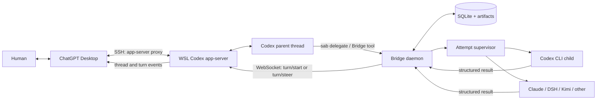

# WSL + ChatGPT Desktop 最终桥接方案

状态：目标架构（共享 app-server 写入链路已验证）  
日期：2026-09-22

## 1. 固定部署假设

- 项目、Codex、Bridge daemon 和所有 headless 子 Agent 都运行在同一个 WSL 环境。
- ChatGPT Desktop 通过 SSH 把该 WSL 注册为远程 Codex host。
- 人在 Desktop 中查看、输入、打断和继续 Codex 会话。
- Codex 主会话调用 WSL 内的 Bridge 委派任务。
- 子 Agent 结束后，Bridge 通过同一个 app-server 主动向原 Codex thread 开启或补充 turn。

Bridge 不再启动第二个 app-server，也不接管 Desktop UI。Desktop 和 Bridge 是同一个 WSL app-server 的两个客户端。

## 2. 最终拓扑



只有 WSL app-server 持有 Codex thread runtime/writer。Desktop 和 Bridge 都连接它的 Unix WebSocket control socket：

```text
~/.codex/app-server-control/app-server-control.sock
```

## 3. 组件职责

### ChatGPT Desktop

- 建立到 WSL 的 SSH remote host；
- 通过 `codex app-server proxy` 连接 WSL app-server；
- 展示 Codex thread、turn 和流式事件；
- 接受人的输入、打断和审批操作。

### WSL Codex app-server

- 是 Codex thread 和 turn 的唯一权威运行时；
- 同时接受 Desktop 与 Bridge 的 WebSocket 连接；
- 发送 `thread/status/changed`、`turn/started`、`turn/completed` 等事件；
- 持久化会话，使 Bridge 写入立即出现在 Desktop。

### Bridge daemon

- 提供 `delegate/status/cancel/acknowledge` 等本地接口；
- 持久化 task、attempt、delivery、parent binding 和 lease；
- 启动、监督和恢复 headless 子 Agent；
- 订阅父 thread 状态，并串行化同一父 thread 的写操作；
- 子任务完成后，通过共享 app-server 投递结果。

### 子 Agent

- 作为独立 headless 进程运行；
- 只通过结构化协议与 Bridge supervisor 通信；
- 不持有 app-server control socket、Desktop remote payload 或 Bridge control credential；
- 不能继续创建下一层 Bridge 子任务。

## 4. 父会话身份绑定

委派时必须记录发起委派的 Codex thread，不能按标题或“最近会话”猜测。当前实测，Desktop 管理的 Codex turn 内存在：

```text
CODEX_THREAD_ID=<current-thread-id>
CODEX_SESSION_ID=<session-root-id>
```

MVP 使用会话内调用的本地 CLI/skill：

```text
sab delegate --task-file ...
```

`sab` 自动读取这两个环境变量并登记 parent binding，模型无需复制 id。若环境中没有 thread id，命令必须拒绝创建可回投任务，除非调用方显式传入并验证 id。

以后可将同一接口包装成 MCP tool；只有 MCP 调用链能可靠提供当前 thread identity 时，才允许省略显式 parent id。

建议的绑定记录：

```json
{
  "parent_id": "par_<uuid>",
  "codex_thread_id": "01...",
  "codex_session_id": "01...",
  "app_server_generation": 1,
  "host_id": "desktop-ssh-host-id",
  "cwd": "/home/user/project"
}
```

## 5. 完整工作流

### 5.1 建立控制面

1. Desktop SSH 到 WSL。
2. 远端启动或复用唯一的 `codex app-server --listen unix://`。
3. Desktop 的 `app-server proxy` 连接 control socket。
4. Bridge 作为第二个 WebSocket 客户端连接同一 socket并完成 `initialize`。
5. Bridge 监听断线并退避重连；重连后重新订阅仍有 pending delivery 的父线程。

SSH 启动链必须保留 Desktop 所需的代理、CA、`NO_PROXY` 和 remote payload。认证信息不能进入日志或数据库。

### 5.2 主会话委派

1. 人在 Desktop 中向 Codex 主会话提出任务。
2. Codex 调用 `sab delegate`（MVP）或 Bridge tool（后续）。
3. Bridge 从环境绑定当前 thread/session id，先持久化 task、attempt 和 parent generation。
4. Bridge 返回 task id；Codex 可继续当前工作。
5. Supervisor 选择 adapter，在 WSL 项目目录启动独立 headless Agent。

### 5.3 子任务结算

1. Adapter 解析结构化事件并形成统一结果。
2. Supervisor 原子发布 result，以 CAS 结算 attempt。
3. Bridge 创建唯一 delivery，包含 `delivery_id`、task id、结果摘要、artifact 路径和状态。
4. Dispatcher 取得 `parent_thread_id` 级独占 lease，读取 app-server 最新 thread 状态。

### 5.4 主动唤醒父会话

默认采用 `idle` 投递：

1. 父 thread 为 `idle` 时，Bridge 调用 `turn/start`。
2. 输入携带不可变 `delivery_id`，要求父 Codex 读取结果并继续处理。
3. app-server 将输入、进度和回复广播给 Desktop。
4. Bridge 观察 `turn/completed`，记录 native turn id 和提交证据。
5. delivery 标为 `submitted`；父 Agent 消费结果后再标为 `acknowledged`。

`immediate` 仅在父 thread 已有活动 turn、Bridge 掌握准确 `expectedTurnId` 时使用 `turn/steer`。否则保持 pending，等待 idle。

## 6. 并发与抢占

共享 app-server 消除了“两套 app-server 竞争同一 active writer”的进程级冲突，但 Desktop 与 Bridge 仍可能同时操作 turn。每个父 thread 必须执行：

```text
acquire delivery lease
  -> refresh thread status
  -> idle: turn/start
     active + exact turn id: optional turn/steer
     otherwise: keep pending
  -> persist response/turn id
  -> release lease
```

若状态读取后人恰好从 Desktop 开始新 turn，app-server 拒绝 Bridge 请求属于正常竞争。Bridge 重新读取状态并保留原 delivery，不能把冲突或超时当成可无条件重试的新 turn。

数据库对 `delivery_id` 建立唯一约束，交接文本也携带该 id，使父 Codex 能识别已经消费的交接。

## 7. 断线与恢复

- Desktop 断线：app-server 和 Bridge 可继续运行；Desktop 重连后读取持久记录。
- Bridge 与 app-server 断线：子任务不受影响；delivery 保持 pending，重连后投递。
- app-server 重启：Bridge 更新 generation，以精确 thread id 恢复；writer 冲突或实例不匹配进入 `needs_review`。
- Bridge 重启：从 SQLite 恢复 attempt 和 delivery，不重做提交状态不确定的副作用。
- 子 Agent 异常：由 supervisor 结算，不直接改变父 thread。

## 8. 安全边界

- app-server Unix socket 只允许当前 WSL 用户访问，不暴露到非 loopback 网络。
- SSH 是 Desktop 到 WSL 的唯一远程入口。
- Bridge control API 使用 Unix socket 或认证 loopback。
- 子 Agent 不继承 app-server socket、Bridge 管理凭据或 Desktop remote payload。
- delivery 内容按不可信子 Agent 输出处理，用固定交接模板包裹，不能解释为 Bridge 控制命令。
- headless yolo 权限必须结合项目 sandbox、容器或独立用户边界。

## 9. 已验证事实

2026-09-22 已完成：

1. Desktop 通过 SSH 接入 WSL Codex。
2. Desktop 使用 `app-server proxy`，WSL app-server 暴露 Unix WebSocket control socket。
3. Bridge 与 Desktop 同时连接同一个 app-server。
4. Bridge 完成 `initialize` 和 `thread/list`。
5. Bridge 通过共享 socket 执行 `thread/start` 和 `turn/start`。
6. 新 thread `01a0c7f7-a409-7f12-83ab-2efcaefb661b` 返回 `BRIDGE_SHARED_APP_SERVER_WRITE_OK`。
7. Desktop 实时显示该任务和回复，并把它归属到 WSL SSH remote host。
8. 当前 Desktop Codex 会话内可读取准确的 `CODEX_THREAD_ID` 和 `CODEX_SESSION_ID`。

核心闭环中的共享 writer、主动创建/唤醒 turn 和 Desktop 实时观察已经验证。尚待完成的是 Bridge daemon、真实子 Agent 结算和父会话自动回投的产品化串联。

## 10. 实施顺序与验收

### P0：共享 app-server connector

- 将 demo 提取为长期连接的 `CodexAppServerConnector`。
- 支持 initialize、重连、订阅、thread read/resume、turn start/steer 和事件关联。
- 实现每 thread 写 lease 与 delivery 幂等键。

验收：Bridge 对测试 thread 连续启动两个顺序 turn，Desktop 均实时显示。

### P1：Codex 到 Bridge 的委派入口

- 实现 `sab delegate`，自动读取并验证 `CODEX_THREAD_ID`。
- 提供 Codex skill，定义委派、状态查询和 artifact 引用。
- 建立 parent binding、task、attempt、delivery 数据表。

验收：从 Desktop Codex 会话发起委派，数据库 parent thread id 与当前会话一致。

### P2：一个真实子 Agent 闭环

- 完成一个 adapter、supervisor 和结构化 result。
- 子任务完成后创建 idle delivery。
- Dispatcher 在父 thread idle 时调用 `turn/start`。

验收：人只在 Desktop 发出一次委派；子 Agent 完成后，原会话自动出现结果交接和 Codex 后续回复。

### P3：竞争、恢复和 immediate

- 测试人与 Bridge 同时 `turn/start`。
- 测试 Desktop、Bridge 和 app-server 断线恢复。
- 能可靠取得 active turn id 后启用 `turn/steer`。
- 注入重复 delivery，验证只消费一次。

验收：无 active-writer 抢占、无静默丢失、无重复新 turn，不确定提交进入 `needs_review`。

## 11. 存储总体原则

参考 `herdr-subagent-bridge` 中与 Herdr 无关的存储机制，Bridge 采用严格分离的两层存储：

- **全局控制面**：Bridge 独占写入，保存 SQLite、不可变意图、进程证据、冻结结果、delivery 与审计日志；
- **项目 exchange 数据面**：主 Agent 和子 Agent 可见，保存一次 attempt 的输入、待收集结果和任务产物。

SQLite 是调度状态的唯一权威源。项目 exchange 不是任务状态数据库；缺少 exchange 文件不能凭空改变数据库状态，exchange 中出现结果也不能在校验和冻结前代表任务成功。

文件 envelope schema、exchange schema 与数据库 schema 分别版本化。三者演进速度不同，不共用一个 `schema_version`。

## 12. 全局控制面目录

默认目录：

```text
$XDG_STATE_HOME/subagent-bridge/
├── bridge.sqlite3
├── bridge.sqlite3.lock
├── daemon.sock
├── trace.jsonl
├── trace.jsonl.lock
├── archive/
└── tasks/
    └── <task-id>/
        └── attempts/
            └── <attempt-id>/
                ├── manifest.json
                ├── task.json
                ├── launch.json
                ├── result.collected.json
                ├── events.jsonl
                ├── stdout.log
                └── stderr.log
```

职责划分：

- `manifest.json`：不可变 envelope，声明 identity、schema 版本、文件角色和 exchange 路径；
- `task.json`：不可变请求快照，记录用户要求、adapter、delivery mode、父绑定和 resolved config；
- `launch.json`：可随启动阶段原子替换，记录准备、启动、PID、process-group、deadline 和 exact argv；
- `result.collected.json`：Bridge 从子 Agent 可写区域校验并冻结的结果证据，创建后不可覆盖；
- `events.jsonl`：归一化事件日志；
- stdout/stderr：有界原始诊断数据，不作为权威状态。

控制面目录由 Bridge 创建为 `0700`，文件为 `0600`。现有符号链接、非目录或不属于当前用户的异常路径一律拒绝或保持不动，不能顺着链接修改目标。

## 13. 项目 exchange 目录

每个 Git worktree 使用自己的数据面：

```text
<project>/.subagent-bridge/
├── .gitignore
└── exchange/
    └── <task-id>/
        └── attempts/
            └── <attempt-id>/
                ├── manifest.json
                ├── inputs/
                │   ├── task.md
                │   └── context.md
                └── outputs/
                    ├── result.json
                    └── <artifacts...>
```

规则：

1. 查找最近的 Git worktree 根；没有 Git 时使用显式 workspace root。
2. `.subagent-bridge`、`exchange` 和 attempt 目录不能是符号链接。
3. 局部 `.gitignore` 的最后一条有效规则必须是 `*` 或等价 catch-all，避免运行数据进入 Git；不修改项目根 `.gitignore`。
4. `inputs/task.md` 和可选 `inputs/context.md` 是逐字节快照，不使用源文件原名，避免与框架文件冲突。
5. `outputs/result.json` 是子 Agent 唯一的结构化提交入口；artifact 必须位于同一 attempt 的 `outputs/` 下。
6. manifest 明确列出输入、输出和 artifact 相对路径约定，子 Agent 不靠目录猜测协议。

数据库的 `project_workspaces` 表记录规范化后的 `project_root → exchange_root` 映射；attempt 同时记录 `control_path`、`exchange_path` 和 `project_root`，便于维护、审计和迁移。

## 14. 数据库模型补充

建议的核心表：

| 表 | 作用 | 关键约束 |
| --- | --- | --- |
| `meta` | 数据库 schema 与迁移时间 | schema 高于当前程序版本时拒绝打开 |
| `app_server_instances` | WSL app-server generation、socket 与连接状态 | 不保存代理口令或 remote payload |
| `parent_sessions` | Bridge parent id 与 Codex thread/session/host 绑定 | thread id + generation 唯一 |
| `agent_sessions` | Bridge 子 Agent session 与原生 session ref | 原生 ref 只能来自结构化证据 |
| `tasks` | 逻辑任务和 continuation 链 | `previous_task_id` 外键；保存 context hash/version |
| `attempts` | 一次执行及其进程、路径、状态和结果摘要 | 一个 task 可有多个 attempt；不确定提交阻止自动 retry |
| `deliveries` | 向父 Codex 的一次交接 | message hash、receipt hash、native turn id、状态 |
| `delivery_items` | delivery 与 task/attempt/result version 的关联 | 组合唯一，防止同一结果重复建 delivery |
| `leases` | worker、task、session、parent-thread 排他租约 | `(scope,key)` 主键，带 fencing generation |
| `project_workspaces` | worktree 与 exchange root 映射 | project root 唯一 |
| `observations` | app-server/thread/进程观测证据 | 带来源、采样时间和摘要 |

SQLite 初始化要求：

- 数据库文件在连接前以 `0600` 创建，父目录为 `0700`；
- 启用 foreign keys 和 busy timeout；
- migration 使用相邻锁文件并在 `BEGIN IMMEDIATE` 中逐版本执行；
- 写状态转换使用事务和带旧状态条件的 CAS；
- UTC 时间统一写成带显式 offset 的 ISO-8601，排序时不能依赖混杂格式的纯字符串顺序。

## 15. 不可变上下文快照

在启动子 Agent 前完成 context snapshot：

1. 对 task/context 进行有界读取，拒绝缺失、空文件、非普通文件和超限输入；
2. 使用固定目标名写入 exchange 的 `inputs/`；
3. 以 task 与 context 的长度前缀、域分隔内容计算 `context_version`；
4. 保存各文件 SHA-256 和字节数；
5. 同一 attempt 重复写入只有在字节完全相同时才幂等成功，不同内容拒绝覆盖；
6. 子 Agent 的 result 必须回显相同 `context_version`。

多文件快照不是单个文件系统事务，因此每个文件先写私有临时文件并 `fsync`，再在 attempt 锁下逐个 `os.replace`。若进程在中间崩溃，用相同输入重跑会补全；输入变化则 fail closed，避免混合新旧上下文。

## 16. 结果收集与冻结

子 Agent 写出的 `outputs/result.json` 属于不可信数据。Collector 必须：

1. 拒绝 result 文件本身或任一路径分量为符号链接；
2. 对实际读取字节执行上限检查，而不是只相信 `stat`；
3. 校验 JSON schema、`task_id`、`attempt_id` 和 `context_version`；
4. 校验 `status`、`summary`、`verification` 与 `needs_parent` 类型；
5. 将 artifact 规范化为相对 `outputs/` 的路径；拒绝绝对越界、`.`、`..`、目录、链接和不存在文件；
6. 对通过校验的精确字节计算 SHA-256；
7. 在全局控制面 attempt 目录创建 `result.collected.json`，使用独占发布语义，已有文件不得覆盖；
8. 把冻结路径、hash 和 result status 事务性写入 attempt；
9. delivery 只引用冻结结果，绝不引用仍可被子 Agent 修改的 `outputs/result.json`。

若两个 collector 竞争，首个冻结版本获胜；后来字节不同则进入 `needs_review`。这避免子 Agent 在校验后重写结果造成 TOCTOU。

建议的结果最小结构：

```json
{
  "schema_version": 1,
  "task_id": "task_...",
  "attempt_id": "att_...",
  "context_version": "v1-...",
  "status": "completed",
  "summary": "...",
  "artifacts": ["report.md"],
  "verification": {
    "performed": ["..."],
    "limitations": []
  },
  "needs_parent": []
}
```

## 17. 原子写入、日志与权限

Bridge 自己拥有的 JSON 文件统一采用：

```text
create unique temp (0600)
  -> write + flush + fsync(file)
  -> os.replace(temp, destination)
  -> fsync(parent directory)
```

append-only JSONL 采用 `O_APPEND`，每行写完 `fsync`。追加和轮转共同锁定永久存在的相邻 `.lock` 文件；不能锁日志文件本身，因为 rename 后旧文件描述符仍可能写入旧 inode。

任何 secret、代理认证、SSH 私钥、Desktop remote payload 和 app-server bearer token 都不能写进 task、launch、trace 或 SQLite。exact argv 落盘前必须对敏感参数做结构化脱敏，同时保留不可逆 hash 供审计比较。

## 18. Delivery 的持久化语义

交付阶段采用：

```text
pending -> dispatching -> submitted -> acknowledged
                    \-> delivery_unknown
                    \-> needs_review
```

关键规则：

- 建 delivery 前，以 `(task_id, attempt_id, handoff_type, result_version)` 查询已有记录；存在则返回已有 delivery。
- receipt 只存 hash，明文 token 只在创建时返回给父会话交接模板。
- 取得 parent-thread lease 后，必须在发送前再次校验 lease owner、generation、有效期、父绑定 generation 和最新 thread 状态。
- 在调用 `turn/start/steer` 之前先把 delivery CAS 为 `dispatching`。
- 明确收到 app-server 接受响应后写 `submitted`，并保存 native turn id。
- 进程若在 `dispatching` 期间崩溃，恢复时转为 `delivery_unknown`，不能自动回到 pending；因为 turn 可能已经被 app-server 接受。
- 明确的“未发送”错误可回到 pending；超时、断线或响应丢失都属于 unknown。
- acknowledgment 必须同时验证 receipt、parent identity、generation 和可确认阶段，并允许幂等重复确认。

交接文本固定包含 `delivery_id`、task/attempt id、result status、冻结结果路径与“不可信数据”提示。父 Codex 处理完成后调用 acknowledge；`turn/completed` 只能证明唤醒 turn 结束，不能自动证明父 Agent 已正确消费结果。

## 19. Lease 与 fencing

租约记录包含：

```text
(scope, key, owner, generation, expires_at)
```

- `acquire` 新建或接管过期租约时递增 generation；
- 同一 owner 续租不改变 generation；
- `renew` 发现 owner、generation 或有效期不匹配时立即停止工作；
- 任何外部副作用前都重新读取并校验 fencing token；
- parent-thread lease 串行化 Bridge delivery，但不能锁住 Desktop，因此仍需把 app-server 冲突视为正常竞态；
- session lease 防止同一子 Agent native session 被 resume、retry、cancel 同时操作；
- worker 全局 lease 防止多个 reconciler 同时接管恢复循环。

租约过期不等价于进程死亡，也不授权直接重复执行。Reconciler 必须结合 PID start token、进程组、数据库状态、事件日志和冻结结果重新判断。

## 20. 创建 attempt 的持久化顺序

建议顺序：

1. 规范化 workspace，拒绝危险路径和链接。
2. 数据库事务创建 task、session、attempt，状态为 `created`，预留全部 id。
3. 创建 control/exchange 目录与不可变 manifest。
4. 快照 task/context，写入 context version/hash。
5. 原子写 `task.json` 与包含“准备启动”意图的 `launch.json`。
6. 取得 session/task lease，并重新检查不存在活动 attempt。
7. 在数据库和 launch record 中持久化 exact launch intent。
8. 启动子进程并立即记录 PID、process group、start token 和 deadline。
9. CAS 转为 `starting/running`；随后由事件和进程证据推进状态。

原则是“先记录意图，再产生外部副作用”。如果无法确认 prompt/turn 是否已提交，使用 `submission_unknown`，禁止自动 resume 或 retry 覆盖它。

## 21. Reconcile 与维护

启动和周期性 reconcile 至少处理：

- 过期但进程仍存活的 attempt；
- 已退出但尚未 collect 的 attempt；
- exchange 有结果而数据库未冻结的 attempt；
- `dispatching` 且 owner lease 已失效的 delivery；
- app-server 断线后的 pending delivery；
- 数据库有记录但 control/exchange 目录缺失，或目录存在但无数据库记录的 orphan；
- 取消过程中遗留的进程组。

维护命令默认 dry-run。删除以“闭包”为单位：task continuation 链、attempt、delivery item、冻结结果和 exchange 目录必须一起评估。下列对象不得自动删除：

- 活动 attempt 或 cancellation；
- `submission_unknown` / `delivery_unknown` / `needs_review`；
- 尚未 acknowledged 的 delivery；
- 被 continuation、delivery 或 session 关系引用的记录；
- 无法证明位于注册 control/exchange root 内的目录；
- 符号链接目录。

删除顺序先在事务中验证引用闭包并删除数据库记录，再删除已经解析和校验过的具体目录；文件删除失败要报告为 orphan，不能伪装为成功。trace rotation 同样使用相邻锁，并保留有限天数的归档。

## 22. 从参考项目迁移与舍弃的边界

直接迁移的通用逻辑：

- SQLite migration、foreign key、事务、CAS 和 fencing lease；
- 全局 control plane 与项目 exchange 的拆分；
- attempt manifest 和独立 schema 版本；
- immutable context snapshot 与 context version；
- result 的限长、身份、artifact 路径校验和冻结证据；
- delivery 去重、monotonic acknowledgment 和 unknown 不自动重发；
- 私有权限、原子写、相邻日志锁、dry-run retention 和 orphan 检测。

不迁移的 Herdr 专属逻辑：

- pane、terminal、workspace tab 和 agent name 身份；
- `HERDR_ENV`、Herdr socket、hook event 和 `agent prompt`；
- pane 状态推断、pane 关闭与终端输出抓取；
- Herdr plugin manifest、bootstrap hook 和 radar/状态徽标；
- 依赖 pane identity 的 acknowledgment。

这些位置分别替换为：

| Herdr 参考机制 | 当前方案替换 |
| --- | --- |
| pane/session identity | `CODEX_THREAD_ID` + `CODEX_SESSION_ID` + app-server generation |
| hook status event | app-server `thread/status/changed` / `turn/*` notification |
| `agent prompt` | app-server `turn/start` / `turn/steer` |
| Herdr server scope | Desktop SSH host id + app-server socket instance |
| pane lease | parent-thread delivery lease |
| terminal result fallback | headless adapter structured result；缺失时失败或 `needs_review` |

## 23. 存储与恢复验收矩阵

实现阶段必须加入不依赖模型、SSH 或 Desktop 的离线测试：

1. 数据库从每个旧版本逐级迁移；新版本数据库被旧程序拒绝。
2. 状态目录/文件权限分别为 `0700/0600`，符号链接不会被跟随或 chmod。
3. JSON 原子发布包含 file fsync、rename 与 directory fsync。
4. trace 追加和轮转共享相邻锁，事件不会落入旧 inode。
5. 同一 attempt 的并发 context snapshot 只接受相同字节。
6. result 超限、身份错误、context version 错误、artifact 越界或链接均被拒绝。
7. 子 Agent 在 collect 前后篡改 `result.json`，delivery 仍引用首次冻结字节。
8. 重复完成事件只创建一个 delivery。
9. `acknowledged` 不能被迟到的 dispatcher finalizer 降级回 `submitted`。
10. `dispatching` 窗口崩溃恢复为 `delivery_unknown`，不自动再次 `turn/start`。
11. lease 丢失后旧 worker 在产生副作用前被 fencing check 阻止。
12. retention 不删除 active、unknown、未确认、continuation 引用或路径不可信对象。

需要 Desktop/WSL 集成环境的在线测试：

1. 主会话调用 `sab delegate` 后 parent binding 与当前 thread id 一致。
2. 子任务完成时父 thread idle，恰好产生一个 `turn/start`。
3. 人与 Bridge 同时启动 turn，失败一方重新排队且不重复交付。
4. app-server 接受请求后连接立刻断开，delivery 进入 unknown 并等待人工/协议证据核对。
5. Desktop 离线后 Bridge 完成任务；Desktop 重连仍能看到投递结果。
6. app-server 重启或 generation 改变时，旧 parent binding 不被静默复用。
